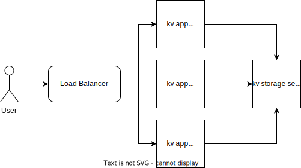

# Key Value Storage service

## Architecture



## Deployment steps
```
1. Dockerise storage service (stateful, in memmory database)
2. Dockerise app service (stateless, can scale horizontally)
3. Create docker-compose.yml 
4. kompose convert to convert docker compose to kubernetes deployment config.
5. Update the deployment manifests with the docker images
6. kubectl deploy <comma separated.yaml> (assuming kubernetes service already running)
7. Expose kvapp behind a load balancer
    - minikube tunnel 
    - kubectl expose deployment kvapp --type=LoadBalancer --name=lb
    - kubectl get services lb
    - get the external ip and access the app
```
